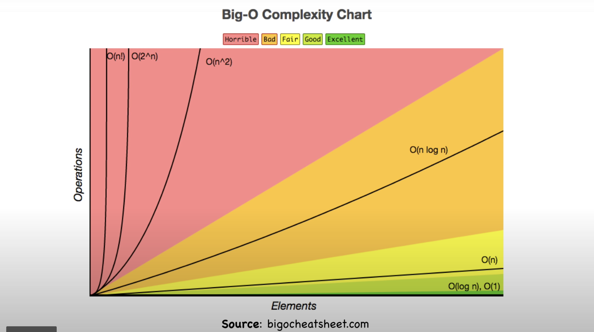

# 
 T2_A1_B_Workbook 

The ACME Corporation is interested in building a marketplace web application (app) using Rails for one of it’s product lines. To help it choose the vendor who will undertake the project they have released a RfQ. As an aspiring junior dev at an up and coming Sydney software startup (CAx-Dev) your manager has assigned you to assist with preparation of the RfQ response.

The efficiency of an app (i.e. site) and the algorithms used are of the utmost importance. The next set of questions relate to this RfQ-requirement.

## Q1 Identify and explain the workings of TWO sorting algorithms and discuss and compare their performance/efficiency (i.e. Big O)
---
#### What is a Sorting Algorithm?
In simple terms, a sorting algorithm is a method used to reorganize a set of items into a desired pattern, that pattern is up to the desires of the user running the algorithm and can be of many forms, least-to-highest, alphabetical, or even and odd are just a few of the myriad options available. The two that will be be discussed below will provide a deeper understanding into the nature of sorting algorithms. following that a performance and efficiency comparison will be provided in the event that ACME were interested in utilizing either of these options. 

 

1. Merge Sort
    - Merge sort is commonly seen as one of the most efficient sorting algorithms available for processing sets of values. the way it works is by taking an unordered or unsorted list of values and breaking that list down into a group of single item arrays, each populated with a single value from the initial array or set of unsorted values. Once the set is broken down into individual elements it is then recombined using a basic ruleset until all of the singular entity arrays are combined into one array containing the whole set of values once more, only this time those values are ordered based off the specifications of the algorithm. A good example to use would be sorting an array of integers in order of lowest-to-highest value. The algorithm would process the set or array by taking it apart and separating each integer into its own array. From here it would begin adding each single value array to another, when doing so it would compare the value of one array's integer with the other using the greater than, less than, or equal to operators. Each value is processed and added into the new sorted array in the order specified and as the algorithm proceeds through group of single entities it compares the single entity with the most recent addition to the sorted list, this way it can either add the entity on to the end of the list if it is greater than the current endpoint or recurisvely go back through the list using these same operators to insert the entity at the point that it  should be placed. This process would be repeated again and again with a sorted array of increasing size until the original set had been recreated, however this time it would be sorted based off restriction value specified. This is considered to be the Top down approach to merge sorting and uses what is called recursion to repeatedly go through the set of values and ask the same question in relation to order the set, if the answer is yes the operation will run and further reduce the complexity of the list. Once complexity is reduced to its lowest level the list can begin to be repopulated by combining values as stated above. 
    - Time Complexity ((n log(n))) - Best, (O(n log(n))) - Worst
2. Bubble Sort
    - Bubble sort, unlike merge sort, is seen as one of the least efficient sorting algorithms as it has the capacity to move to a complexity level of n^2 when the sorting algorithm is required to iterate over nested loops. The way the bubble sort method works can be best explained with an unsorted array of values. In terms of the case used to exemplify the merge sort algorithm above, bubble sort can also be used to sort through an array of unsorted integer values ordering them in rank of lowest to highest value or vice versa. Considering the array imagine that the first value of this imaginary array is array(n) and its adjacent value is array(n+1). Bubble sort will move through an array considering each adjacent pair of values, based off the desired analysis and sorting mechanism it will position those adjacent values in the desired location in relation to one another exclsuively. It is very important to note that bubble sort will only consider one pair of adjacent values at a time. In the case of the example array, the bubble sort algorithm will take array(n) and array(n+1) and either swap their places if array(n) is greater than array(n+1) or leave them in their place if they are in the correct order. From here the algorithm will now consider the next adjacent pair, which would be array(n+1) and array(n+2). It will then repeat the same value consideration as it did for the first adjacent pair, and if array(n+1) is greater than array(n+2) then it will swap places with array(n+2). This same process will be repeated over and over, moving or bubbling the highest values of the set contained within the array to their appropriate position and restarting at the beginning of the array for each time that it reaches the end of the total set of values within the array. This means that iterations will be run over and over until the array is completely sorted. At a glance it should be easy to see why this sorting mechanism will be inefficient, especially for sets whose n value is huge say, 1,000,000 or more. 
    - Time Complexity (n) - Best, (O(n^2)) - Worst

### Performance and Efficiency Comparison
- Efficiency
    - In relation to the Two requirements of this document it will be valuable to explain what it is that ACME should be concerned about when considering efficiency and in order to do so it will be helpful to have a general definition of what is meant by efficiency in relation to these algorithms. Here, efficiency is the mathematical definition of output of an algorithm as far as its ability to process a given set of data over time in relation to other algorithms. The fastest or most efficient algorithms are those whose efficiency is unneffected by altering the value of n, the size of the data set or value set. Above, each sorting method has a Time complexity linked to it, this is what is referenced when considering efficiency. The best possible level of efficiency is one that is constant or O(1), in this case time complexity is not effected at all by changes in the size of the dataset which is incredibly valubale when processing massive ammounts of data. The worst case is factorial or O(n!) in this case large data sets massively balloon processing time and it is highly recommended that unless otherwise directed, an algorithm with this complexity is avoided. 
- Performance and Efficiency comparison
    - With the above definition of efficiency in mind and an understanding of the time complexities of both merge and bubble sort algorithms, it is now possible to compare the two so that ACME may make an informed decision of which one to use. As can be seen from the attached graph, while the best case scenarios of bubble and merge sort dictate that bubble sort algorithms can out perform their merge sort counterparts, this only remains the case as long as these algorithms are iterating over a set once and not in a nested fashion where an algorithm would be required to loop through data within another larger loop, as would be the case when sorting an unsorted array of numbers like the examples displayed above. Given that the worst case scenarios have bubble sort's time complexity becoming quadratic and, therefore, becoming much larger than that of merge sort it is recommended that ACME consider whether or not the data that they intend to iterate over is capable of being corrected in a single loop or if it would be better covered through nested iterations. In the case of a nested iteration, it is the recommendation of this RFQ that ACME utilize a merge sort algorithm as it will drastically increase time efficiency when the data set that ACME is covering becomes larger and larger as it surely will in the future.
    - 

[Source](https://www.interviewbit.com/tutorial/sorting-algorithms/)
[Merge_Sort](https://www.youtube.com/watch?v=TzeBrDU-JaY)
[Bubble_Sort](https://www.youtube.com/watch?v=Jdtq5uKz-w4&list=RDCMUClEEsT7DkdVO_fkrBw0OTrA&index=4)
[understanding_bubbleSort](https://www.honeybadger.io/blog/ruby-bubble-sort/)
 

## Q2 Identify and explain the workings of TWO search algorithms and discuss and compare their performance/efficiency (i.e. Big O)
--- 
#### What is a Search Algorithm?
Just as in the section above, a formal definition of what a search algorithm is will be beneficial for further discussion and comparison analysis in order for ACME to be prepared to make an informed decision on what methods would be best suited to utilize moving forward. Keeping things as simple as possible, a search algorithm is set of predefined instructions that allow for the processing of a set of data in order to select a specific or desired value that exists within that data and return it. In the case that the dataset does not include this desired element, a search algorithm will additionally be designed to return a message notifying the user that the element does not exist within the specified dataset. Going further, search algorithms can typically be broken down into two separate fields, sequential and interval searches. As the name implies, a sequential search is one in which every element of the dataset is sequentially processed and checked for its status as the desired entity or not, this will occur over the entire length of the set if necessary and should immediately be seen as potentially time-hazardous in the case of large sets. Linear search is an example of a sequential search. Interval searches, unlike sequential searches go about processing sorted sets of data by continually dividing the set into smaller subsets. By this division the interval search can more rapidly attain its intended goal should it be the case that the set to be searched through is something huge like a company database. Binary search is an example of an interval search. 
1. Linear search 
    - In order to more definitively understand linear search, think of the 26 letters of the alphabet. Assign each one a number 0-25 and then place them into an array with 26 elements (the 0th element is considered A and the 25th is Z). In this scenario imagine that the intended goal is to search through the array and return the position of the letter K (index 10). A linear search algorithim will handle this request in the following way: one-by-one, or sequentially, beginning with index 0, it will check the value at that index and compare it with the desired value, if that value is not the value that it is tasked to search for it will proceed onto to the next value and continue this process until it locates the desired value or reaches the end of the set at which point it will return an error. In this case, since the letter K is at index 10, it will take this algorithm 10 steps to locate and return the desired value.
    - Time Complexity: O(n) 
2. Binary search 
    - Consider the same array of letters as above. Unlike the linear search that must go value-to-value regardless of position in relation to the desired value, the binary search has the ability or is hardcoded with the capacity to "make a choice" in relation to its location in the search when considered against its target value. In other words, the binary search algorithm will go about locating K in an entirely different manner than the linear search. In binary search the total set of data, or the array in this case, is divided in half. At this stage the binary search will check the current value or the midway point value against the desired value. If it turns out to be equal then it will return that value and its index, otherwise if the value of its current position is greater than the value desired, it will reduce the possible search field to the lower half of the array disregarding the upper half whose values would all be higher than the desired value given that the midway point is so. This halving will be repeated continually until the desired value is located or the algorithm exhausts the set of data and proceeds to return an error indicating that the desired value is not present in the array. In the case of the K example from above it will take a binary search algorithm 3 or 4 possible steps in order to locate K and return its index in the array. 
    - Time Complexity: O(log n)

### Performance and Efficiency Comparison
- Before discussing comparative efficiency and performance, there are some important differences to note in relation to these two search methods that will better help ACME determine when would be the best time to use either option. To begin, a binary search must be fed sorted data, if this case is not met the basic functionality of the binary search and its halving protocol will be rendered moot. Linear search does not require data to be sorted. Additionally, as stated above, linear search must begin at the 0th or final index of the array, as it must move sequentially from adjacent entity to the next unlike binary search which is capable of being run at any random point within the array and still being able to function correctly. Finally, due to the nature of their design, linear search functions through a comparison of equality in relation to desired data while binary search functions by performing ordering comparisons in order to locate the position that its desired data artifact must be at in relation to its surrounding elements.  

[Source](https://codersera.com/blog/let-us-understand-searching-algorithms/)
