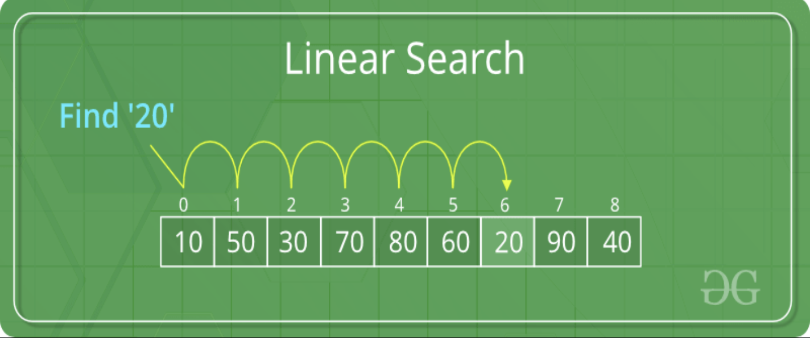

# 
 T2_A1_B_Workbook 

# Q1 Identify and explain the workings of TWO sorting algorithms and discuss and compare their performance/efficiency (i.e. Big O)
---
## What is a Sorting Algorithm?
In simple terms, a sorting algorithm is a method used to reorganize a set of items into a desired pattern, that pattern is up to the desires of the user running the algorithm and can be of many forms, least-to-highest, alphabetical, or even and odd are just a few of the myriad options available. The two that will be be discussed below will provide a deeper understanding into the nature of sorting algorithms. Following that, a performance and efficiency comparison will be provided in the event that ACME is interested in utilizing either of these options. 

 

1. Merge Sort
    - Merge sort is commonly seen as one of the most efficient sorting algorithms available for processing sets of values. It works by taking an unordered or unsorted list of values and breaking that list down into a group of single item arrays, each populated with a single value from the initial array or set of unsorted values. Once the set is broken down into individual elements it is then recombined using a basic ruleset until all of the singular entity arrays are combined into one array containing the whole set of values once more, only this time those values are ordered based off the specifications of the algorithm. A good example to use would be sorting an array of integers in order of lowest-to-highest value. The algorithm would process the set or array by taking it apart and separating each integer into its own array. From here it would begin adding each single value array to another, when doing so it would compare the value of one array's integer with the other using the greater than, less than, or equal to operators. Each value is processed and added into the new sorted array in the order specified and as the algorithm proceeds through the group of single entities it compares the single entity with the most recent addition to the sorted list. This way it can either add the entity on to the end of the list if it is greater than the current endpoint or recurisvely go back through the list using these same operators to insert the entity at the point that it should be placed. This process is repeated continually until the original set has been recreated, however this time it is sorted based off the specified sorting mechanism. 
    - This is considered to be the Top down approach to merge sorting and uses what is called recursion to repeatedly go through the set of values and ask the same question to order the set. If the answer is yes, the operation will run and further reduce the size of the list. Once list size is reduced to single entity arrays, the list or array can begin to be repopulated by combining values as stated above. 
    - Time Complexity ((n log(n))) - Best, (O(n log(n))) - Worst
    - Please see attached photos from the referenced interviewbit source for a pictorial example of how merge sort would iterate over an array. 
     
     
    - 
    - 
2. Bubble Sort
    - Bubble sort, unlike merge sort, is seen as one of the least efficient sorting algorithms as it has the capacity to move to a complexity level of n^2 when the sorting algorithm is required to iterate over nested loops. The way the bubble sort method works can be best explained with an unsorted array of values. In terms of the case used to exemplify the merge sort algorithm above, bubble sort can also be used to sort through an array of unsorted integer values ordering them in rank of lowest to highest value or vice versa. Considering the array, imagine that the first value of this imaginary array is array(n) and its adjacent value is array(n+1). Bubble sort will move through the array considering each adjacent pair of values. Based off the desired analysis and sorting mechanism it will position those adjacent values in the desired location in relation to one another exclsuively. It is very important to note that bubble sort will only consider one pair of adjacent values at a time. In the case of the example array, the bubble sort algorithm will take array(n) and array(n+1) and either swap their places if array(n) is greater than array(n+1) or leave them in their place if they are in the correct order. From here the algorithm will now consider the next adjacent pair, which would be array(n+1) and array(n+2). It will then repeat the same value consideration as it did for the first adjacent pair, and if array(n+1) is greater than array(n+2) then it will swap places with array(n+2). This same process will be repeated over and over, moving or bubbling the highest values of the set contained within the array to their appropriate position and restarting at the beginning of the array for each time that it reaches the end of the total set of values within the array. This means that iterations will be run over and over until the array is completely sorted. At a glance it should be easy to see why this sorting mechanism will be inefficient, especially for sets whose n value is huge say, 1,000,000 or more.
    - Time Complexity (n) - Best, (O(n^2)) - Worst
    - Please see attached photo from the referenced blog by Julie Kent for a pictorial example of how bubble sort would move a value of 45 through an array. 
     
     
    - 

## Performance and Efficiency Definition & Comparison

### Efficiency
- In relation to the two requirements of this document it is necessary to explain what it is that ACME should be concerned about when considering efficiency. In order to do so, a general definition of what is meant by efficiency in relation to these algorithms is necessary. 
- Here, efficiency is the mathematical definition of the output of an algorithm as far as its ability to process a given set of data over time is concerned in relation to other algorithms. The fastest or most efficient algorithms are those whose efficiency is unneffected by altering the value of n, the size of the data or value set. 
- Above, each sorting method has a time complexity linked to it, this is what is referenced when considering efficiency. 
    - The best possible level of efficiency is one that is constant or O(1). This can be seen represented in the complexity graph below as falling into the green zone or the "excellent/good" zone. In this case, time complexity is not effected at all by changes in the size of the dataset which is incredibly valubale when processing massive ammounts of data. 
    - The worst case is factorial or O(n!). This can be found in the complexity graph below as being classified in the pink or "horrible" zone. In this case large data sets massively balloon processing time and it is highly recommended that unless otherwise directed, an algorithm with this complexity is avoided. 
### Performance and Efficiency comparison
- With the above definition of efficiency in mind and an understanding of the time complexities of both merge and bubble sort algorithms, it is now possible to compare the two so that ACME may make an informed decision of which one to use.
      
    ### Best case consideration
    - As can be seen from the attached graph, the best case scenarios of bubble and merge sort (referenced in the section above that defined both) show that bubble sort algorithms can out perform their merge sort counterparts, and prove to be more efficient. However, this only remains the case as long as these algorithms are iterating over a set once. More commonly, they will iterate over nested loops where a logic loop lies within another larger loop. This scenario is very common when operating with large data sets as would be the case when sorting an unsorted array of numbers and outputting them in a specific format.
     
    ### Worst case consideration
    - In the worst case scenarios (also listed above in the definition section), bubble sort's time complexity becomes quadratic. Referencing the complexity chart below, quadratic (n^2) complexity falls into the pink or "horrible" zone falling just short of factorial complexity. 
    - Therefore, bubble sort's complexity becomes much larger than that of merge sort which -- even in its worst case -- remains (n log n), part of the orange or "bad" zone. For this reason it is recommended that ACME consider whether or not the data that they intend to iterate over is capable of being corrected in a single loop. Or if it is the case that it would be better covered through nested iterations. In which case they should consider a merge sort algorithm. 
      
    ### Comparative result recommendation
    - In conclusion and as a result of the reasons provided in this comparison section ACME should consider the following: 
        - In the case of a nested iteration, it is the recommendation of this RFQ that ACME utilize a merge sort algorithm as it will drastically increase time efficiency when the data set that ACME is covering becomes larger and larger as it surely will in the future. Otherwise, if it is possible to avoid nested logic loops then ACME would be best suited with a bubble sort algorithm and its constant (n) or "fair" efficiency. 
     
    - 

[Understanding_merge_sort](https://www.interviewbit.com/tutorial/sorting-algorithms/)
 

[Merge_Sort](https://www.youtube.com/watch?v=TzeBrDU-JaY)
 

[Bubble_Sort](https://www.youtube.com/watch?v=Jdtq5uKz-w4&list=RDCMUClEEsT7DkdVO_fkrBw0OTrA&index=4)
 

[Understanding_bubble_sort](https://www.honeybadger.io/blog/ruby-bubble-sort/)
 

# Q2 Identify and explain the workings of TWO search algorithms and discuss and compare their performance/efficiency (i.e. Big O)
--- 
## What is a Search Algorithm?
- Just as in the section above, a formal definition of what a search algorithm is will be beneficial for further discussion and comparison in order for ACME to be prepared to make an informed decision on what methods would be best suited to utilize moving forward. Keeping things as simple as possible, a search algorithm is set of predefined instructions that allow for the processing of a set of data in order to select a specific or desired value that exists within that data set and return it. In the case that the data set does not include this desired element, a search algorithm will additionally be designed to return a message notifying the user that the element does not exist within the specified data set. 
    - Search algorithms can typically be broken down into two separate fields, sequential and interval searches. 
        - A sequential search is one in which every element of the dataset is sequentially processed and checked for its status as the desired entity or not. This process will occur over the entire length of the set if necessary and should immediately be seen as potentially time-hazardous in the case of large sets. See attached time complexity graph from previous section. 
            - Linear search is an example of a sequential search. 
        - Interval searches, unlike sequential searches, go about processing sorted sets of data by continually dividing the set into smaller subsets. By this division the interval search can more rapidly attain its intended goal (as far as time complexity is concerned) should it be the case that the set to be searched through is something huge like a company stock database. 
            - Binary search is an example of an interval search. 
 

1. Linear search 
    - In order to more definitively understand linear search, consider the 26 letters of the english alphabet. Assign each one a number 0-25 and then place them into an array with 26 elements (the 0th element is considered A and the 25th is Z). In this scenario imagine that the intended goal is to search through the array and return the position of the letter K (index 10). A linear search algorithim will handle this request in the following way: one-by-one, or sequentially, beginning with index 0, it will check the value at that index and compare it with the desired value, if that value is not the value that it is tasked to search for then it will proceed onto to the next value and continue this process until it locates the desired value or reaches the end of the set at which point it will return an error. In this case, since the letter K is at index 10, it will take this algorithm 10 steps to locate and return the desired value.
    - Time Complexity: O(n) 
    - Here is an example of how to create a linear search method using the ruby programming language by [Alberto Carreras](https://a-carreras-c.medium.com/ruby-searching-algorithms-for-dummies-cdaadc277923) on medium:
        - 
    - Here is a graphic example of Linear search from [Geeksforgeeks.org](https://www.geeksforgeeks.org/linear-search/):
        - 
2. Binary search 
    - Consider the same array of letters as above. linear search must go value-to-value regardless of position in relation to the desired value. However, binary search has the ability or is hardcoded with the capacity to "make a choice" in relation to its location in the search when considered against its target value. In other words, binary search will go about locating K in an entirely different manner than linear search. In binary search the total set of data, or the array in this case, is divided in half. At this stage binary search will check the current value or the midway point value against the desired value. If it turns out to be equal then it will return that value and its index, otherwise if the value of its current position is greater than the value desired, it will reduce the possible search field to the lower half of the array. At the same time it will disregard the upper half whose values would all be higher than the desired value given that the midway point is so. This halving will be repeated continually until the desired value is located or the algorithm exhausts the set of data and proceeds to return an error indicating that the desired value is not present in the array. In the case of the K example from above it will take a binary search algorithm 3 or 4 possible steps in order to locate K and return its index in the array. 
    - Time Complexity: O(log n)
     
    - Here is an example of how to create a binary search method using the ruby programming language by [Alberto Carreras](https://a-carreras-c.medium.com/ruby-searching-algorithms-for-dummies-cdaadc277923) on medium:
        - 
     
    - Here is a graphic example of Binary search from [Geeksforgeeks.org](https://www.geeksforgeeks.org/binary-search/):
        - 

### Performance and Efficiency Comparison
- Before discussing comparative efficiency and performance, there are some important differences to note in relation to these two search methods that will better help ACME determine when would be the best time to use either option. 
    1. A binary search must operate on sorted data, if this case is not met the basic functionality of binary search and its halving protocol will be rendered moot. 
    2. Linear search does not require data to be sorted.
        - Linear search must begin at the 0th or final index of the array, as it must move sequentially from adjacent entity to the next unlike binary search which is capable of being run at any random point within the array while still being able to function correctly. 
    3. These searches operate through different comparative mechanisms
        - Linear search functions through a comparison of equality in relation to desired data. 
        - Binary search functions by performing ordering comparisons in order to locate the position that its desired data artifact must be at in relation to its surrounding elements. 
- Using 1, 2, and 3 above it is now possible to appropriately compare efficiency and performance. Referencing the same time complexity chart from the sorting algorithm in section 1 (also copied below for ease of access), it is possible to consider which of these searches is immediately favored. Due to its having a time complexity of (n), linear search must ruled out as the most time-efficient option as its complexity falls into the yellow or "fair" band of time complexities as the data set grows. In comparison, the (log n) of binary search which falls into the light green or "good" band of time complexities will grow at a much smaller rate. This should not come as a surprise to ACME as linear search is typically used as a teaching mechanism and less so as an actual method of searching a data set. Additionally, in the examples laid out above this inequality of time efficiency is evident in binary search being able to reach its intended target in 3-4 steps while linear does the same search in 10 steps.
- It should be noted that in certain cases linear search will prove to be more effective merely by chance. A specific example of this would be if the data object desired was located at the very beginning of the array of items. In this case linear search would naturally have to start at its location and thus return the item immediately. This is a rather unlikely scenario however and as a result it does not weigh heavily on the decision to recommend use of binary search over linear search. 
 

- Time Complexities: 
- 

[Comparison-source_1](https://codersera.com/blog/let-us-understand-searching-algorithms/)
 

[Comparison_source_2](https://www.geeksforgeeks.org/linear-search-vs-binary-search/)

